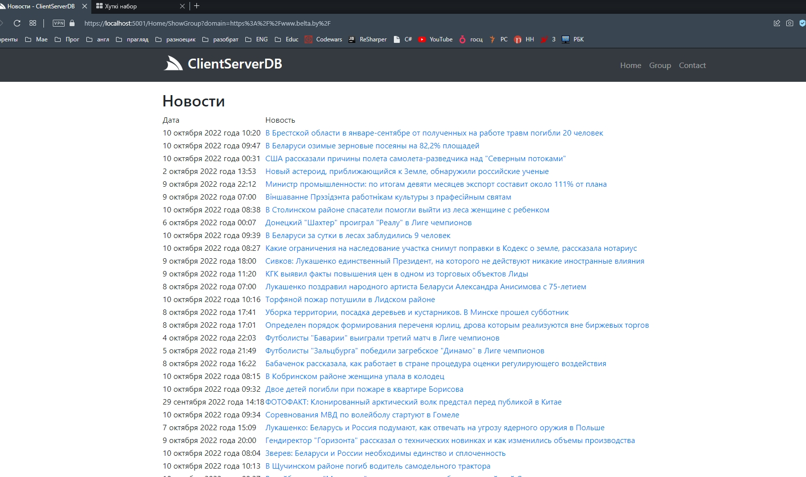

# Проект анализа новостей
---
### - .Net Core 5
### - Docker
### - Postgres
### - Task(многопоточность)
---
<br>

#### Запуск докер-контейнера:
```
docker container run -d --name=psq1 -p 2345:5432 -e POSTGRES_PASSWORD=praj -v "${pwd}/pgdata:/pgdata" postgres:14.1
```
---





